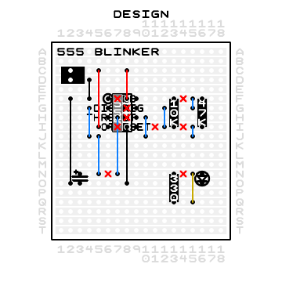
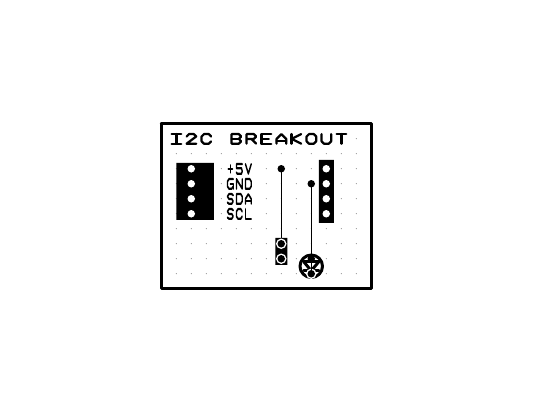

# stripboard

Design **stripboard** (protoboard / veroboard) circuit layouts in Python, and render them
to a PDF you can solder from — plus a silkscreen label, laser g-code, an SVG, and a
3D-printable carrier.

Stripboard is prototyping board with parallel copper strips running across one face. You
place components on the grid, cut the strips where two nets must not share one, and add
jumper wires where a net has to cross between strips. Doing that on paper is tedious and
easy to get wrong. This library lets you write it down instead:

```python
from stripboard import project

def draw(sb):
    sb.text(1, 'A', 'BLINKER')
    u1 = sb.dip(6, 'F', 3, 4, '555', pins=['GND', 'TRIG', 'OUT', 'RESET',
                                           'CTRL', 'THRESH', 'DISCH', 'VCC'])
    r1 = sb.resist(13, 'F', '10K', l=3)
    led = sb.led(16, 'N')

    sb.net('VCC', u1.pin('VCC'), u1.pin('RESET'), r1.pin(1), color='r')
    sb.net('GND', u1.pin('GND'), u1.pin('CTRL'), led.pin('K'), color='k')
    sb.autoroute()

project(draw, name='blinker', width=18, height='T')
```



You declare what is *electrically* true and `autoroute()` works out the copper — which
strips carry which net, where the jumpers go, and which tracks to cut. Or route it
yourself with `jumper()` / `cut()` / `trace()` and keep full control. Both workflows are
in [`examples/`](examples).

**No runtime dependencies.** Pure standard library, including the PDF writer and the
autorouter.

## Install

```sh
pip install stripboard
```

Requires Python 3.12 or newer.

## Getting started

```sh
stripboard new my-board     # scaffold my_board.py in the current directory
python my_board.py          # -> my_board.pdf
```

Edit `draw(sb)`, re-run, look at the PDF. When the layout is right, flip
`designing = False` to get the build sheet.

## Output

`project()` decides what to emit from its keyword arguments:

| Argument | Produces | What it's for |
|---|---|---|
| *(always)* | `<name>.pdf` | The board. `designing=True` gives a one-page DESIGN preview; `designing=False` gives the FRONT / BACK / DESIGN build sheet. |
| `label=True` | `<name>-label.pdf` | Black-and-white silkscreen, for toner transfer or a laser. |
| `gcode=True` | `<name>.nc` | GRBL laser g-code that etches that silkscreen onto the board top. |
| `carrier=True` | `<name>.stl` | A 3D-printable carrier that the finished board slots into. Needs OpenSCAD. |

The three views on the build sheet are the three ways you actually look at the board:
**FRONT** as you place components, **BACK** mirrored as you cut tracks and solder, and
**DESIGN** with each net flood-filled in colour so you can check connectivity by eye.



## Coordinates

A 1-based integer grid. Columns are numbers running along `x`; rows are letters
(`'A'` = 1 … `'Z'` = 26) or plain ints, running along `y`. Copper strips run
**horizontally**, so two pins on the same row are already connected — that is the whole
trick of the format, and most of the design work is deciding where to break it.

Board sizes take either spelling: `width=18, height='T'` is the same as
`width=18, height=20`.

## Routing

Every part builder returns a handle whose `.pin(name)` gives a netlist reference:

```python
u1 = sb.dip(6, 'F', 3, 4, '555', pins=['GND', 'TRIG', ...])
sb.net('GND', u1.pin('GND'), c1.pin(2), color='k')   # a whole net at once
sb.connect(u1.pin('OUT'), r3.pin(1))                 # or one edge at a time
result = sb.autoroute(seed=0)
```

`autoroute()` returns the solver's result — status, cost, per-net status, validation — and
draws the jumpers and cuts it chose. Pass `locked=False` to a part builder to let the
solver place that part too, and it will be drawn wherever it lands.

The solver lives in `stripboard.router` and is usable on its own; see
[`docs/router-spec.md`](docs/router-spec.md).

## Development

```sh
git clone https://github.com/samw3/stripboard-py
cd stripboard-py
pip install -e ".[dev]"

pytest                  # fast suite
pytest -m ''            # everything, including the solver tests
ruff check src tests
mypy
```

## Licence

MIT. See [LICENSE](LICENSE).
